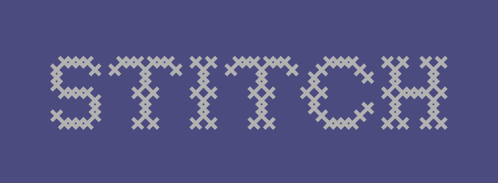

    

# Stitch: Weaving micro-services together

Stitch is a utility CLI that streamlines the local development of micro-services together through stitching together various development tools.

# Commands

| Command              | Description                                |
| -------------------- | ------------------------------------------ |
| `stitch compose add` | adds a service to your docker-compose file |
